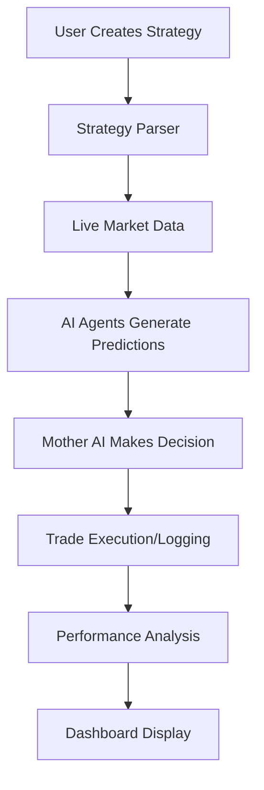

# AI Trading Platform 🤖📈

A sophisticated cryptocurrency trading platform powered by machine learning agents and a "Mother AI" orchestration system. Features real-time market analysis, automated strategy execution, and comprehensive backtesting capabilities.

## 🌟 Key Features

- **Multi-Agent System**: Individual AI agents for 10+ cryptocurrency pairs (BTC, ETH, ADA, etc.)
- **Mother AI Coordination**: Meta-level decision engine that coordinates all agent signals
- **Real-time Trading**: Live market data integration with Binance exchange
- **Strategy Builder**: Visual JSON-based strategy creation and management
- **Advanced Backtesting**: Historical performance simulation with detailed analytics
- **Interactive Dashboard**: Modern React-based UI with real-time charts

## 🧠 System Overview

### Core Architecture

| Component  | Technology | Purpose |
|------------|------------|---------|
| **Frontend** | React + Tailwind | Dashboard, charts, strategy builder, predictions display |
| **Backend** | FastAPI + Python | API routes, ML agents, Mother AI, backtesting engine |
| **Storage** | Local JSON | Strategies, trade logs, performance data |
| **Exchange** | Binance API | Live market data and trade execution |

### 🔄 How It Works



## 🚀 Quick Start

### Prerequisites
- Python 3.9+
- Node.js 16+
- Binance API credentials (optional, for live trading)

### Installation

1. **Clone and setup backend**
   ```bash
   git clone <repository-url>
   cd crypto-trading-platform
   
   # Install Python dependencies
   pip install -r requirements.txt
   
   # Start backend server
   python run_server.py
   ```

2. **Setup frontend**
   ```bash
   # Install Node.js dependencies
   npm install
   
   # Start development server
   npm run dev
   ```

3. **Access the application**
   - Frontend: http://localhost:3000
   - Backend API: http://localhost:8000

## 📁 Key System Components

### 🤖 AI Agents (`backend/agents/`)
- **Individual agents** for each cryptocurrency pair
- **Trained ML models** stored as pickle files
- **Real-time prediction** generation based on market data
- **Technical indicator** integration (RSI, MACD, Bollinger Bands)

### 🧠 Mother AI (`backend/mother_ai/`)
- **Meta-decision engine** that evaluates all agent predictions
- **Risk management** and position sizing
- **Performance tracking** and profit calculation
- **Trade execution** coordination

### 📊 Strategy Engine (`backend/strategy_engine/`)
- **JSON-based strategy** configuration
- **Strategy validation** and health monitoring
- **Dynamic parsing** and execution
- **User-friendly strategy builder** interface

### 🔄 Backtesting (`backend/backtester/`)
- **Historical simulation** with configurable parameters
- **Performance metrics** (Sharpe ratio, max drawdown, win rate)
- **Multi-strategy testing** capabilities
- **Visual performance reports**

## 🔧 Configuration

### Environment Setup
Create `.env` file:
```env
BINANCE_API_KEY=your_api_key
BINANCE_SECRET_KEY=your_secret_key
BINANCE_TESTNET=true
MAX_POSITION_SIZE=0.1
STOP_LOSS_PERCENTAGE=0.02
```

### Risk Management
Edit `backend/storage/risk_config.json`:
```json
{
  "max_daily_loss": 0.05,
  "max_position_size": 0.1,
  "stop_loss_percentage": 0.02,
  "allowed_pairs": ["BTCUSDT", "ETHUSDT", "ADAUSDT"]
}
```

## 📡 API Endpoints

| Endpoint | Method | Purpose |
|----------|--------|---------|
| `/api/agents` | GET | List all agents and status |
| `/api/mother-ai/decision` | POST | Get trading decision |
| `/api/backtest/run` | POST | Run strategy backtest |
| `/api/strategies` | GET/POST | Manage strategies |
| `/api/profits` | GET | Get performance analytics |

## 🎯 System Philosophy

- **🔧 Modular Design**: Agents, strategies, and Mother AI are separate and pluggable
- **🏠 Self-Hosted**: No external cloud dependencies, all data stored locally
- **📝 JSON-First**: Strategy logic is JSON-based for easy sharing and customization
- **🚀 SaaS-Ready**: Designed to scale into multi-user system
- **📴 Offline-Capable**: Full backtesting and simulation without internet connection

## 📊 Data Flow

1. **Strategy Creation** → User builds strategy in React frontend
2. **Data Ingestion** → Live OHLCV data fetched from Binance
3. **Agent Analysis** → Each agent generates predictions for its symbol
4. **Mother AI Decision** → Meta-AI coordinates and selects best signal
5. **Trade Execution** → Decision logged and optionally executed
6. **Performance Tracking** → Results analyzed and displayed

## 🔍 Monitoring

- **Performance Logs**: `backend/storage/performance_logs/`
- **Trade History**: `backend/storage/trade_history/`
- **Strategy Files**: `backend/storage/strategies/`
- **Profit Summaries**: `backend/storage/trade_profits/`

## 🛠️ Development

### Adding New Cryptocurrency
1. Create agent file: `backend/agents/{symbol}_agent.py`
2. Add OHLCV data: `data/ohlcv/{SYMBOL}_1h.csv`
3. Train model: `python backend/agents/agent_training.py`

### Custom Strategy Development
1. Use the Strategy Builder in the frontend, or
2. Create JSON file in `backend/storage/strategies/`
3. Test with backtesting system

## ⚠️ Risk Disclaimer

**This platform is for educational purposes only.** Cryptocurrency trading involves substantial risk of loss. Always:
- Test strategies thoroughly in paper trading mode
- Never risk more than you can afford to lose
- Monitor positions and maintain proper risk controls
- Understand that past performance doesn't guarantee future results

## 📝 License

MIT License - see LICENSE file for details.

---

**Ready to start algorithmic trading? 🚀**

Check the `docs/` folder for detailed technical documentation and setup guides.